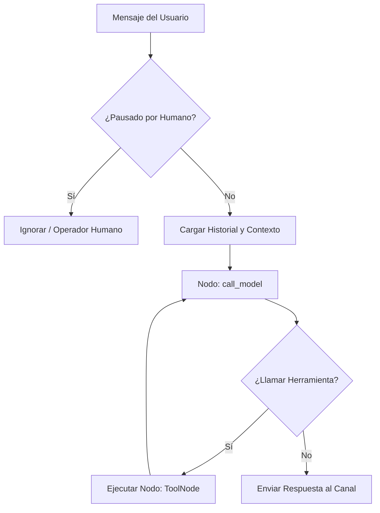

# 🧠 Lógica y Procesamiento del Agente (LangGraph SaaS)

El núcleo conversacional del sistema es un grafo de estados dirigido desarrollado con **LangGraph** (`src/agents/graph_saas.py`). El grafo gestiona el flujo, las llamadas a herramientas y la persistencia de mensajes de forma reactiva por cliente.

## 1. Flujo Conversacional General

1. **Entrada de Mensaje:** Llega a través de los webhooks de WhatsApp (`/webhook/{client_slug}/greenapi`) o el polling de Telegram (`telegram_polling.py`).
2. **Carga de Contexto:** Se inicializa la sesión a través del `thread_id` y `client_id`, recuperando el historial y cargando el `system_prompt` junto con el Conocimiento Oficial y la configuración del cliente.
3. **Nodo `call_model`:** El LLM evalúa el mensaje y decide si invocar una herramienta (como buscar información en RAG, consultar disponibilidad, o agendar un turno) o responder directamente.
4. **Finalización:** Se genera la respuesta final de texto y, si es necesario, se añaden directivas como `[SEND_FILE: topic]` para enviar adjuntos.

---

## 2. Lógica Detallada de Agendamiento y Turnos

El chatbot implementa reglas de negocio estrictas para evitar alucinaciones en los horarios de turnos y garantizar la fidelidad con la base de datos SQL Server:

### Detección de Intención de Agenda (`user_scheduling_intent`)
Al procesar el mensaje del usuario, el sistema busca palabras clave de turnos (ej. "reservar", "turno", "hora", "fecha", "disponibilidad", días de la semana, etc.). Si se detecta intención:
- Se inyecta un **Refuerzo de Agenda** en el prompt de sistema obligando al LLM a llamar de inmediato a la herramienta `consultar_disponibilidad` antes de formular cualquier respuesta sobre turnos. El bot tiene prohibido asumir si un horario está libre u ocupado por su cuenta.

### Validación y Diferenciación de Disponibilidad (Grid vs. Reserva)
La herramienta `consultar_disponibilidad` genera slots en intervalos configurados (ej. 30 minutos) dentro de los horarios laborales y omite los horarios en el pasado o bloqueados por excepciones (feriados). Retorna:
- `horarios_disponibles`: Slots generados libres.
- `horarios_ya_reservados_por_otros`: Turnos de otros usuarios registrados en la base de datos para esa fecha.

**Lógica del LLM ante indisponibilidad:**
- **Si el horario pedido está en `horarios_ya_reservados_por_otros`:** El bot responde que ese horario **ya está ocupado/reservado** por otro cliente.
- **Si el horario pedido NO está en esa lista** (ej. las 23:45, que no coincide con la grilla de intervalos de 30 minutos de la empresa): El bot responde amigablemente que **no es un slot de reserva válido o no está habilitado** para ese día, sugiriendo las opciones reales disponibles más cercanas (antes o después).

### Onboarding de Trámite No Bloqueante
Si un trámite requiere completar datos personales (onboarding) y también permite turnos:
- Si el usuario solicita reservar un turno para un día y hora específicos en cualquier momento del chat, el bot **prioriza agendar el turno inmediatamente** a través de `agendar_turno`.
- Una vez asegurado el turno, el bot reanuda de manera no bloqueante la recolección de los datos restantes del formulario.
- **Identificación obligatoria:** El bot requiere mínimamente el nombre y apellido del usuario para poder invocar `agendar_turno` de forma exitosa. Si no lo conoce, lo solicitará amigablemente antes de confirmar la cita.

---

## 3. Persistencia de Checkpoints
El estado del grafo de conversación de LangGraph se guarda y recupera dinámicamente mediante `SqliteSaver` en el archivo `checkpoints.sqlite`. Esto asegura que las conversaciones mantengan su contexto (incluyendo variables del estado como `form_topic` y datos parciales capturados) a lo largo del tiempo.

---
Zárate System Group - Lógica e Ingeniería de Agentes v2.5.0 SaaS
