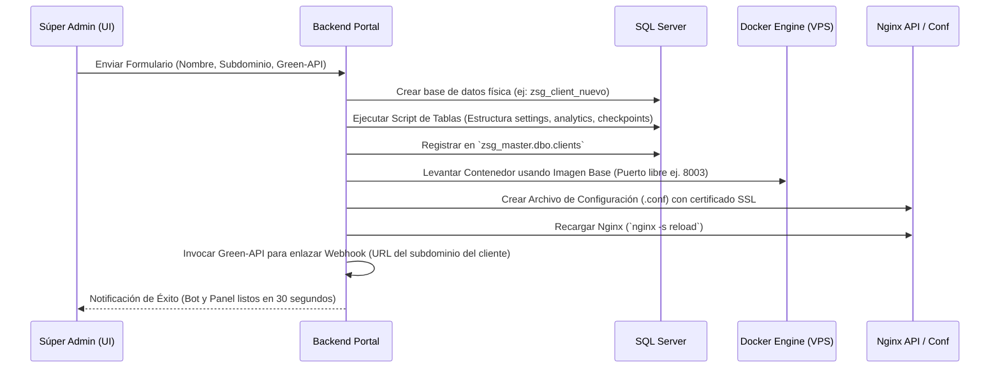

# 👑 Portal de Súper Administrador Centralizado (Modo Dios)

Este documento define la arquitectura, el modelo de datos y los flujos lógicos para implementar el **Portal de Súper Administrador Centralizado** (Esquema de "Modo Dios"), diseñado para controlar todas las instancias de los chatbots y sus paneles administrativos desde un único punto de control.

---

## 🏗️ 1. Arquitectura General y Conectividad

El Portal de Súper Admin se despliega como un contenedor Docker independiente de los bots individuales, conectado a la misma red interna del VPS y apuntando a una base de datos central de control en **SQL Server**.

```text
                                  ┌───────────────────────────┐
                                  │   Subdominios de Acceso   │
                                  └─────────────┬─────────────┘
                                                │
                                                ▼
                               ┌─────────────────────────────┐
                               │   Proxy Inverso (Nginx)     │
                               └────────────────┬────────────┘
                                                │
       ┌────────────────────────────────────────┼────────────────────────────────────────┐
       ▼ (rondan.midominio.com)                  ▼ (dios.midominio.com)                   ▼ (cliente2.midominio.com)
┌───────────────┐                        ┌───────────────┐                        ┌───────────────┐
│ Contenedor    │                        │ Contenedor    │                        │ Contenedor    │
│ Bot Cliente A │                        │ Súper Admin   │                        │ Bot Cliente B │
└───────┬───────┘                        └───────┬───────┘                        └───────┬───────┘
        │ (Conexión SQL Server)                  │ (Conexión SQL Server)                  │ (Conexión SQL Server)
        └────────────────────────┬───────────────┴────────────────────────┬───────────────┘
                                 ▼                                        ▼
                  ┌──────────────────────────────┐         ┌──────────────────────────────┐
                  │ Base de Datos Central        │         │ Base de Datos de Clientes    │
                  │        (master_db)           │         │ (db_cliente_a, db_cliente_b) │
                  └──────────────────────────────┘         └──────────────────────────────┘
```

---

## 🗄️ 2. Estructura de Base de Datos Central (`zsg_master`)

Para centralizar el control, la instancia de SQL Server alojará una base de datos maestra llamada `zsg_master` con la configuración global de clientes y usuarios.

### Tabla: `clients`
Registra el estado de infraestructura de cada cliente.

| Columna | Tipo | Descripción |
| :--- | :--- | :--- |
| `id` (PK) | `INT IDENTITY` | Identificador único del cliente. |
| `client_key` | `VARCHAR(50)` | Identificador de texto (ej. `rondan`, `empresa2`) para rutas y carpetas. |
| `name` | `VARCHAR(100)` | Nombre comercial de la empresa. |
| `db_name` | `VARCHAR(50)` | Nombre de su base de datos física en SQL Server (ej. `zsg_client_rondan`). |
| `internal_port` | `INT` | Puerto interno mapeado en Docker (ej. `8001`). |
| `subdomain` | `VARCHAR(100)` | URL de acceso (ej. `rondan-bot.midominio.com`). |
| `green_api_id` | `VARCHAR(50)` | ID de la instancia de Green-API asociada al cliente. |
| `green_api_token`| `VARCHAR(100)` | Token de la instancia de Green-API. |
| `status` | `VARCHAR(20)` | Estado del cliente: `active`, `suspended`, `provisioning`. |
| `created_at` | `DATETIME` | Fecha de alta del cliente. |

### Tabla: `global_users`
Usuarios del portal "Dios" (Administradores de la plataforma y personal de soporte técnico).

| Columna | Tipo | Descripción |
| :--- | :--- | :--- |
| `id` (PK) | `INT IDENTITY` | Identificador del usuario. |
| `email` | `VARCHAR(100)` | Correo electrónico de acceso. |
| `password_hash` | `VARCHAR(255)` | Contraseña encriptada (bcrypt). |
| `role` | `VARCHAR(20)` | `superadmin` (control total), `support` (solo lectura/asistencia). |
| `last_login` | `DATETIME` | Registro del último ingreso al sistema. |

---

## ⚙️ 3. Flujos Lógicos Clave

### A. Aprovisionamiento Automático de un Nuevo Cliente (Creación Express)
Cuando el Súper Admin registra un nuevo cliente en el portal, el backend realiza la siguiente secuencia de forma automatizada:



### B. Inicio de Sesión por Simulación (Impersonación / "Login As")
El Súper Admin necesita ingresar a los paneles de sus clientes para brindar asistencia. Para evitar almacenar o pedir sus contraseñas, se implementa un flujo seguro de firmas JWT:

1. El Súper Admin hace clic en **"Acceder al Panel"** del Cliente A desde el portal central.
2. El portal central genera un token temporal de un solo uso (válido por 60 segundos), firmado con una **Clave Secreta Compartida (Shared Secret Key)**, que contiene:
   * El ID del cliente.
   * El correo del súper administrador.
   * Rol temporal de "superadmin".
3. El portal redirige al Súper Admin al endpoint del cliente: `https://clienteA.tudominio.com/api/auth/impersonate?token=JWT_FIRMAD0`.
4. El backend del cliente valida la firma del token usando la misma clave secreta, genera una cookie de sesión local con permisos administrativos y redirige al panel del cliente de manera transparente.

---

## 📊 4. Panel de Monitoreo Central (Dashboard Dios)

El portal recopila datos en tiempo real de todos los clientes para mostrarlos en una interfaz unificada:

1. **Estado de WhatsApp de cada Cliente:** El portal realiza peticiones asíncronas en paralelo al endpoint de estado de cada contenedor para mostrar si la instancia de Green-API está conectada (`authorized`), desconectada (`disconnected`) o si requiere QR.
2. **Consumo Consolidado de IA:** 
   * Suma los tokens y costos de OpenAI y Gemini realizando queries agrupados por cliente de las bases de datos de analíticas individuales en SQL Server.
3. **Conversaciones Activas:** Muestra la cantidad de chats procesados por hora/día en toda la plataforma.
4. **Logs Globales:** Consola interactiva para visualizar advertencias críticas del sistema (ej. caídas de webhook, cuellos de botella de red, errores de API en algún contenedor).

---

## 🔒 5. Seguridad y Aislamiento de Privilegios

Para evitar fugas de información y ataques dirigidos:
* **Separación de Credenciales:** Los bots de los clientes no tienen acceso de lectura a la base de datos `zsg_master`. Solo se comunican con su propia base de datos física (`db_cliente_a`).
* **Filtro de IPs para el Portal Central:** El subdominio `dios.midominio.com` puede configurarse en Nginx para permitir acceso exclusivamente desde direcciones IP específicas (la oficina del administrador, VPN privada, etc.).
* **Encriptación de Tokens de Green-API:** Los tokens de WhatsApp de los clientes se almacenan encriptados en la base de datos central (usando un algoritmo simétrico como AES-256) para proteger la privacidad de las líneas de teléfono.
